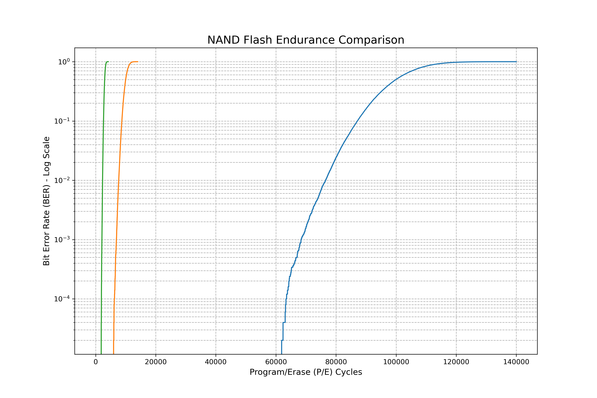

# NAND Flash Endurance Simulator

This project is a Python-based Monte Carlo simulator that models the physical wear-out process of NAND flash memory. The tool simulates the relationship between Program/Erase (P/E) cycles and the resulting Bit Error Rate (BER) for different NAND architectures: SLC, MLC, and TLC.

The final output is a comparative plot that clearly visualizes the significant differences in endurance and reliability among these technologies, demonstrating the characteristic "S-curve" of cumulative device failure.

## Final Results

The simulation automatically runs for SLC, MLC, and TLC architectures and generates the following comparison of their Bit Error Rate (BER) curves over their respective lifespans.



### Analysis
The plot clearly illustrates the trade-off between cost/density and endurance. There is an approximate order-of-magnitude (~10x) decrease in endurance when moving from SLC to MLC, and again from MLC to TLC. The logarithmic scale on the Y-axis is crucial for observing the initial onset of failures, which often determines the practical service life of a device when managed by an SSD controller with Error Correction Codes (ECC).

## Background Concepts

#### P/E Cycle (Program/Erase)
The fundamental action of writing and erasing a NAND cell. Each cycle causes a small amount of degradation to the cell's oxide layer, which is the primary cause of wear.

#### Endurance
The total number of P/E cycles a cell can withstand before it is likely to fail and can no longer reliably store data. This is not a single number but rather a statistical distribution due to manufacturing variations.

#### Bit Error Rate (BER)
The key metric for memory reliability. It's the ratio of failed cells to the total number of cells in a block.
**Formula:** `BER = (Number of Failed Cells) / (Total Number of Cells)`

### Modeling Assumptions
* **Normal Distribution:** The endurance of individual cells is modeled using a normal (Gaussian) distribution, which accounts for cell-to-cell process variation from manufacturing.
* **No ECC:** This simulator models the **Raw Bit Error Rate (RBER)** of the physical cells. It does not simulate the effects of Error Correction Codes (ECC), which are used in real-world SSD controllers to correct a certain number of raw bit errors and extend the device's usable life.
* **Ideal Wear Leveling:** The simulation assumes perfect wear-leveling, meaning all cells in the block are subjected to the same number of P/E cycles.

## How to Run

1.  Clone the repository:
    ```bash
    git clone [https://github.com/bricklayer25/nand-flash-endurance-simulator.git](https://github.com/bricklayer25/nand-flash-endurance-simulator.git)
    cd nand-flash-endurance-simulator
    ```
2.  Set up a Python environment (using Conda is recommended):
    ```bash
    # Create and activate the environment
    conda create --name nand_sim python=3.11 numpy matplotlib
    conda activate nand_sim
    ```
3.  Run the main simulation script from the `src` directory:
    ```bash
    python src/main.py
    ```
    The script will run the simulations for all three NAND types and display the final comparison plot.

## Technologies Used
* **Python 3**
* **NumPy** for efficient numerical operations and random number generation.
* **Matplotlib** for data visualization.